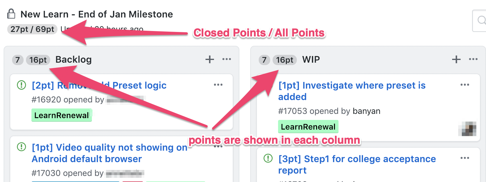

   
  <b>Browser extension to add story points to GitHub projects</b>
  

### Install

- [**Chrome** extension][link-cws] [][link-cws]
- [**Firefox** add-on][link-amo] [][link-amo]

### Usage

You can now add story points to your project board easily.

- For issues, either create your issue with a title starting with `[Xpt]` or simply add a label `sp: X`.
- For cards, simply add a point estimate in the body using the `[Xpt]` format.

GitHub Story Point will count them for you and even show `Closed/Total`.

NOTE - For each task/card, GSP will only count the first point estimate it can find.

### Demo

You can try [demo project](https://github.com/banyan/github-story-points-sandbox/projects/1) after you installed the extension.

### Develop

To develop locally on Chrome:

- Build your extension using `yarn build`.
- Go to `chrome://extensions/` and activate the developer mode (tutorial [here](https://support.google.com/chrome/a/answer/2714278?hl=en) ).
- Finally, click `Load unpacked` and add the folder to the extension.
- If you make changes, you can simply reload the extension using the reload button in `chrome://extensions/`

### Deploy to Chrome and Firefox

### License

MIT

[link-cws]: https://chrome.google.com/webstore/detail/github-story-points/macalhhnmnhceejcjhbgdfidpeeamhep 'Version published on Chrome Web Store'
[link-amo]: https://addons.mozilla.org/en-US/firefox/addon/github-project-story-points/ 'Version published on Mozilla Add-ons'

### Credits

This extension is built on the great work of Kohei Hasegawa, https://github.com/banyan/github-story-points
