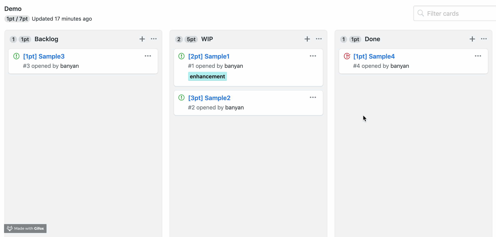

# GitHub Story Points

> Chrome extension to see story points in GitHub projects.

### Installation

### Usage

You need to create issue title stating with `[3pt]` this format and it will accumulate the number of points.

### License

MIT
